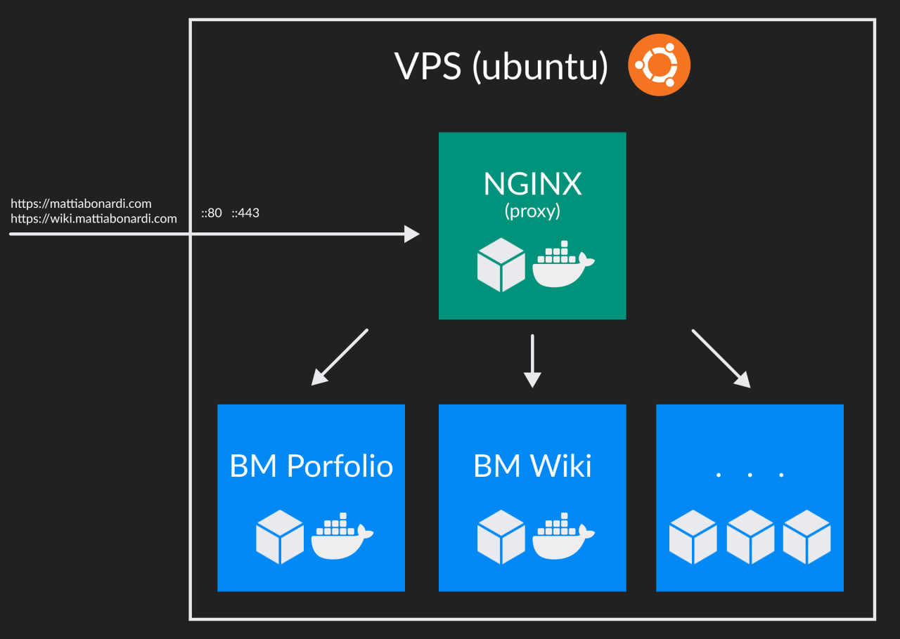

# BM Cluster

IaaS-based project whose role is to manage the deployment of my applications.

BM Cluster is a project based on IaaS (Infrastructure as Code) which allows to install my personal application on premise in an immediate way.

# Goals

I decided to work on this project first of all to learn how to use like **docker** and **linux shell**. On the other hand BM Cluster allowed me to deploy my applications like: BM Portfolio, BM Wiki and TicTacToe3D.

# Architecture

The project is a set of shell scripts that allow you to create, install, and update docker-based containers. BM Cluster via a single command downloads some of my project available on GitHub, creates relative docker images and starts the containers. The infrastructure is managed by a reverse proxy (Nginx) that is responsible for securing access and redirecting calls based on the domain.

# Problems

For this project, I faced no particular problems as linux shell and containers are the order of the day.

# Team

- 1 Full Stack Developer (Me)

# Tecnologies

- linux shell script (.sh)
- docker
- docker-compose
- nginx
- git/github

# Next Steps

The continuation of the project involves a change of technologies. From **Docker** toward **Kubernetes**
