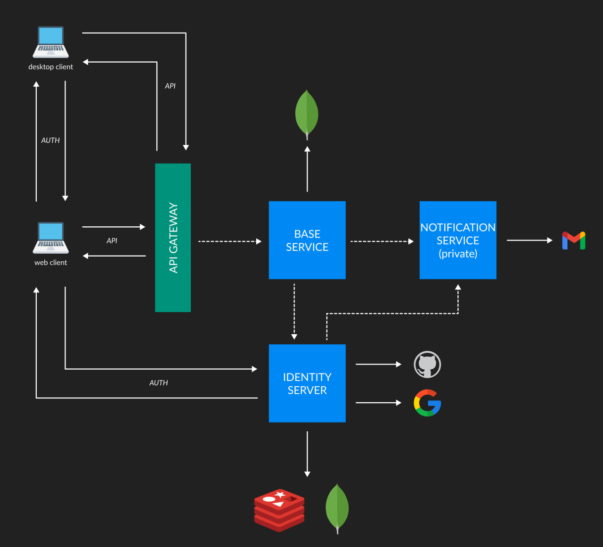

# Qasper

Qasper is a SaaS application for software quality. The application is under construction. Qasper is based on micro service architecture, specifically on the api gateway pattern.

Qasper offers services such as:
- testing
- metrics
- vulnerability assessment

I have included little information on this page, including the source code for copyright reasons.

# Architecture

The architecture is based on micro services, specifically on the api gateway pattern. The main components are:
- Desktop Application: local application
- Web Application: cloud application
- Api Gateway: redirect requests to designed micro service
- Base Service: base apis
- Identity Server: expose all authetication apis
- Notification Service: expose all notification apis.
- MongoDB: persistence storage
- Redis: cache and user session

# Problems

The biggest problem I have had to manage is the creation of the architecture itself since services can also be delivered over local networks.

# Team
- 1 Full Stack Developer (Me)
- 1 UI/UX Designer

# Tecnologies
- Typescript: programming language
- React.js: UI
- Nginx: api gateway
- Wails: Go desktop application framework (like Electron.js)
- Go Gin: High performance micro services framework
- MUI: UI component library