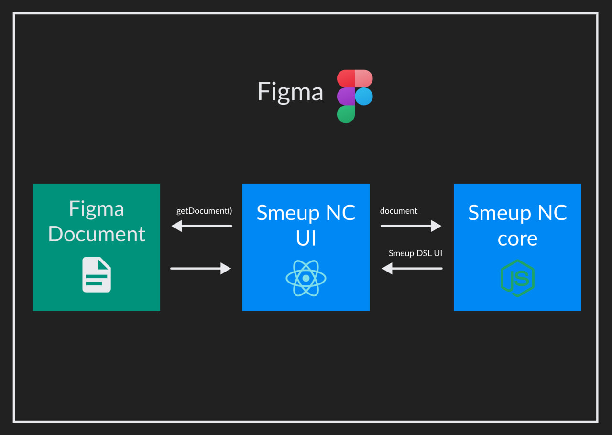

# Smeup No Code

No Code integration for Smeup UI.

Smeup NC is a Figma plugin which allows to generate Smeup UI DSL from Figma design file. The plugin is provided with Smeup Figma components library. Users can create mockups of Smeup ERP and in the end they can export the relative DSL.

# Goals
No code platforms are very powerful for non-technical professionals because they abstract the complexity. Smeup S.p.A has a dedicated application consultancy lob which has no technical figures. For Smeup consultants using a no-code platform is very useful. The personal goals of the project are increase my skills around event-driven programming, React.js and Node.js.

# Architecture
The plugin consists of two projects: smeup-nc-core and smeup-nc-ui. The first converts Figma components into SCP_SCH (Smeup UI DSL) and the second is the plugin UI. Plugin UI retrieves the page layout and call the core to get the relative DSL converted.

# Problems
The main problem I faced was converting from widget absolute layout to a special layout definiton in Smeup DSL based on based on row and column divisions (similar to Bootstrap).

# Team
* 1 Full Stack Developer (Me)
* 1 UI/UX Designer (Fabrizio Feitor)

# Tecnologies

* Typescript: programming language
* Figma: visual editor
* React.js: UI
* Vite: optimize code building
* Node.js: Backend engine
* CSS: styles
* HTML: templating