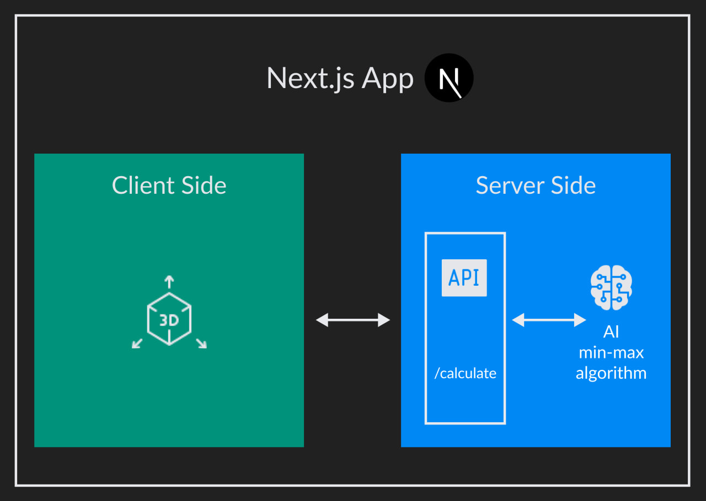

# Tic Tac Toe 3D

Tic Tac Toe game in 3D mode served by full stack javascript framework.

Tic Tac Toe 3D reproduces tic tac toe game in 3D mode. The project is based on **Next.js** and is written in **Typescript**, **HTML** and **CSS**. The UI is created using **Mui Components** and **Three.js**. The user plays against AI (min max algorithm) but it is still possibile to win through a particular solution: thinking out of the box.

[Source code](https://github.com/mattiabonardi/tictactoe-ddd)

# Goals

I decided to create this project to learn React.js, to practise with 3D model and to know the benefit of Next.js instead of Nuxt.js (Vue.js framework). 

# Architecture
Next.js is a full stack javascript framework based on Node.js for the server side and React.js for the client side. The framework offers a great solution to implement server side rendering in an optimal way with React.js. For each user event, the client side 3D component calls the AI served by server side API to get the optimal tic tac toe move.

# Problems
The main difficulties I encountered concern the lack of knowledge of React.js and the handling of Three.js events.

# Team
- 1 Full Stack Developer (Me)
- 1 UI/UX Designer

# Tecnologies
- Typescript: programming language
- Next.js: full stack JavaScript framework
- React.js: UI
- Three.js: 3D models
- Node.js: Backend engine
- CSS: styles
- HTML: templating